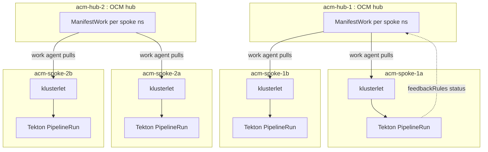

# ACM test topology - real OCM + Tekton on kind

The simulated fleet (`fleet/fleet.py`) carries CRDs only, so nothing on it can ever *execute* anything.
This topology is the opposite: a small, disposable estate with real controllers, built to test ACM-triggered pipeline execution end to end.

It stands up 6 additional kind clusters, completely separate from the simulated fleet:

- 2 hubs (`acm-hub-1`, `acm-hub-2`) running [Open Cluster Management](https://open-cluster-management.io/) (OCM), the upstream project RHACM is built on, installed with `clusteradm`.
- 4 spokes (`acm-spoke-1a/1b`, `acm-spoke-2a/2b`) joined as real `ManagedCluster`s with a running klusterlet, each also running Tekton Pipelines.



## Running it

Prerequisites: Docker, kind, kubectl, Python 3, and `clusteradm`.
If `clusteradm` is missing, `make acm-up` prints install options for the pinned version.

```sh
make fleet-venv      # one-time, shared with the simulated fleet
make acm-up          # 6 clusters + OCM + Tekton (~5-8 min first run)
make acm-status      # cluster / ManagedCluster / Tekton / PSA state
make acm-smoke       # ManifestWork -> PipelineRun end-to-end test
make acm-down        # delete only the acm-* clusters
```

`acm-up` is idempotent and `acm-down && acm-up` rebuilds the whole estate deterministically.
Internal kubeconfigs are exported to `fleet/kubeconfigs/acm-*.kubeconfig` (reachable from containers on the `kind` docker network).
`data-layer/config/hubs.yaml` is deliberately not touched, so the collector keeps ignoring these clusters.

## What the smoke test proves

`make acm-smoke` drives the exact path a production pipeline trigger would:

1. A `ManifestWork` is created on `acm-hub-1` in the `acm-spoke-1a` namespace.
2. The spoke's work agent pulls it and applies the payload: the `pipelines` namespace and a `PipelineRun`.
3. Tekton on the spoke actually executes the run (a pinned busybox step under the restricted profile).
4. `feedbackRules` (JSONPaths on the `Succeeded` condition) report the result back into the ManifestWork status on the hub.
5. The test exits nonzero unless the run succeeds on the spoke *and* the hub sees `succeeded-status=True`.

This is not a simulation.
The same CR shapes, API groups (`work.open-cluster-management.io`, `cluster.open-cluster-management.io`, `tekton.dev`), and status plumbing exist on a real RHACM estate.

## How it maps to real ACM

RHACM is OCM plus product layers.
The APIs this topology exercises are identical in both:

| This topology | Real RHACM estate |
|---|---|
| `clusteradm init` on a kind hub | MultiClusterHub operator install |
| `clusteradm join` + accept | cluster import / klusterlet deployment |
| `ManagedCluster` CR | same CR, same API group |
| `ManifestWork` + feedbackRules | same CR, same API group |
| Tekton Pipelines (upstream) | OpenShift Pipelines operator (same engine) |

## Fidelity gaps

Know what this environment does not prove:

- OCM has no RHACM product layers: no console, no governance policy add-on out of the box, no Observability, no Hive/cluster provisioning.
- Upstream Tekton is not the OpenShift Pipelines operator: operator defaults, `ClusterTask`/resolver catalogs, and console integration differ.
- kind is not OpenShift: no SCCs, no `Route`, no OAuth, no `ClusterVersion` machinery, single-node clusters.
- The `pipelines` namespace enforces the `restricted` Pod Security Standard as the closest approximation of OpenShift's restricted SCC.
  This catches most run-as-root and privilege-escalation mistakes before they fail on real OCP, but it is not the same admission machinery.

Validation against real RHACM and OpenShift Pipelines belongs on real clusters.
See [docs/real-cluster-environments.md](real-cluster-environments.md) for what to request.

## The pipeline-controller seam

The N8N patching workflow currently POSTs to a placeholder (`http://pipeline-controller.example.local/api/runs` in `patching/n8n-patching-workflow.json`) with `{cluster, target_version}`.
This topology is the environment that seam will be wired into.
The eventual pipeline-controller maps a cluster name to its owning hub, creates a ManifestWork shaped exactly like the smoke test's (namespace plus PipelineRun plus feedbackRules), and reports progress back from the ManifestWork status.
Until that controller exists, `fleet/acm.py smoke` doubles as the reference implementation of that flow.

## Resource guidance

Rough steady-state memory, measured on Docker Desktop:

| What | Memory |
|---|---|
| ACM topology (6 clusters, OCM, Tekton) | ~7-9 GB |
| Simulated fleet (10 CRD-only clusters) | ~6-10 GB |
| Compose stack (db, api, dashboard, observability, n8n) | ~2-3 GB |

All three fit in a 24 GB Docker allocation, but tightly.
The safe default is one fleet at a time: `make fleet-down` before `make acm-up` (or the reverse).
If you run many kind clusters simultaneously and see nodes failing to start, raise the Docker Desktop VM's inotify limits (`fs.inotify.max_user_watches`, `fs.inotify.max_user_instances`).

## Version pins

All pins live in [`fleet/acm-topology.yaml`](../fleet/acm-topology.yaml).

| Pin | Value | Why |
|---|---|---|
| `kind_node_image` | `kindest/node:v1.33.7@sha256:...` | digest-pinned node image from the kind release notes |
| `clusteradm` | `v1.3.1` | CLI release expected on the host (warn-only) |
| `ocm_bundle` | `1.3.1` | OCM operator bundle for `init` and `join`, keeps hub and klusterlet images identical across runs |
| `tekton_release` | `tektoncd/pipeline/releases/download/v1.14.1/release.yaml` | pinned Tekton LTS stream from GitHub release assets, never `latest` |
| `smoke_image` | `busybox:1.36` | pinned step image for the smoke PipelineRun |

To bump: change the value, `make acm-down && make acm-up && make acm-smoke`, and commit the pin change only when the cycle is green.
