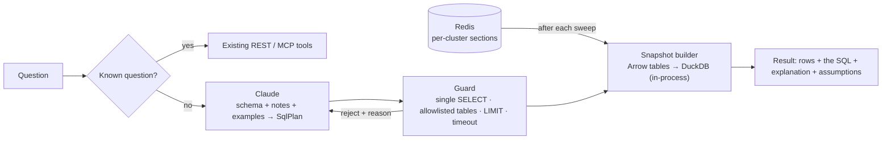

# ADR-0002: Natural-language questions over the fleet ("text-to-SQL")

- Status: accepted (September 2026)
- Related: [ADR-0001](0001-redis-as-fleet-state-store.md), [ADR-0003](0003-enterprise-scale.md), [`docs/nl-query.md`](../nl-query.md)

## Context

Operators and application teams want to ask questions the product did not anticipate: "which prod clusters in us-east run an nginx image older than 1.25 and which teams own those namespaces", "how many certificates expire in the next 14 days per region", "which OLM packages drift across more than three versions".
Today an agent can answer many questions through the MCP tools (`blast_radius`, `expiring_certificates`, `inventory` ...), but each tool answers one shaped question; combining, aggregating and filtering across them is done by the agent in prose, which is slow, expensive and error prone.

The requirement is "text-to-SQL": let a person or an agent ask in natural language and get a tabular answer with the query that produced it.
The store is Redis (ADR-0001), which has no SQL engine, and Postgres is not allowed.

## Options considered

| Option | How | Assessment |
|---|---|---|
| 1. NL → existing REST/MCP tools only | The agent picks tools; no new query surface | Safe and bounded, and it stays the right path for known questions. It cannot express joins or aggregations the API did not ship; every new question is a code change. |
| 2. NL → RediSearch query (`FT.SEARCH` / `FT.AGGREGATE`) | Index the documents in Redis Stack; the LLM writes RediSearch aggregation pipelines | Requires Redis modules (not universally available); RediSearch has no joins, so blast-radius style questions are impossible in one query; LLMs write this dialect poorly and there is no ecosystem for validating it. |
| 3. NL → SQL over an embedded analytical engine fed from Redis (**chosen**) | After every sweep, build a relational snapshot (the former Postgres schema) in DuckDB, an in-process library; the LLM writes DuckDB SQL against a documented semantic layer; a hard guard validates and executes it | Real SQL with joins, aggregations and window functions; the schema is the one already documented; DuckDB is a library, not a database service, so the deployment stays Redis-only; SQL is the dialect LLMs are best at and the one with mature validators (sqlglot). |
| 4. NL → SQL over a separate warehouse or lakehouse | Export to Parquet in object storage, query with Trino / BigQuery / Athena | The best long-term analytical answer for history and cost, but it adds a platform dependency the constraint forbids today. The snapshot format chosen here (per-table Arrow / Parquet) is the same one such a warehouse would ingest, so this stays an upgrade path, not a rewrite. |
| 5. NL → graph query (Cypher / Gremlin) | Model cluster → namespace → workload → image as a graph | The impact questions are graph-shaped, but they are two-hop joins that SQL handles; a graph database is a new dependency and a dialect LLMs handle worse than SQL. |

## Decision

Provide natural-language querying as **NL → SQL over a DuckDB snapshot of the Redis state**, with a semantic layer, a hard guard, transparency and an evaluation set, and keep the MCP tools as the first resort for known questions.

Architecture:

1. **Snapshot.** The relational shape is the former Postgres schema (`hubs`, `clusters`, `cluster_operators`, `nodes`, `namespaces`, `workloads`, `workload_images`, `workload_refs`, `pod_issues`, `resources` with a JSON `summary`, `resource_status`, `health_checks`, `health_snapshots`, `collection_runs`).
   It is rebuilt from the Redis sections after each sweep (lazily on first query, cached until the next sweep invalidates it).
   DuckDB runs in the API process; per-request cursors, one build lock.
2. **Semantic layer.** The prompt the model sees is generated, not hand-written: DDL from the snapshot, a one-line description per column, domain notes (applications are `namespaces` rows with `ns_class = 'application'`; certificates are `resources` rows with `expires_at`; `summary` is JSON and how to extract from it; status vocabularies), live enumerations sampled from the data (regions, environments, versions, resource keys), and a dozen worked examples.
   This is the contract to maintain when the schema changes.
3. **Guard (security-critical).** Exactly one statement, `SELECT` / `WITH ... SELECT` only, every table in the allowlist, no table functions or file / system functions (`read_csv`, `read_parquet`, `glob`, `getenv`, catalog functions), `LIMIT` enforced and capped, a wall-clock timeout that interrupts the query, a row cap.
   The engine is an in-memory, read-only snapshot, so the worst outcome of a bad query is a wrong or slow `SELECT`, never a write, a file read or a network call.
4. **Generation.** Claude (`claude-opus-5` by default, `ODL_QUERY_MODEL`) through the official SDK with structured output (`sql`, `explanation`, `assumptions`, `confidence`); the stable schema prompt is cached as a prefix so each question costs only its own tokens; medium effort.
   A self-correction loop feeds a guard rejection or an execution error back once.
5. **Transparency.** Every answer returns the SQL that ran, the explanation, the assumptions and the snapshot generation; the dashboard and the MCP tools show the SQL.
   `POST /api/query/sql` lets a person run their own guarded SQL directly.
6. **Routing.** The MCP tool descriptions steer the agent: existing tools for shaped questions, `ask_fleet` for ad-hoc joins and aggregations.
7. **Evaluation.** `tests/golden_questions.yaml` holds question → reference SQL → expected result; the reference SQL runs in CI against a fixture snapshot (no LLM), and `scripts/eval_ask.py` runs the questions through the live model and scores result equality.
   Prompt changes are judged by this score, not by taste.

## Why this is the best approach for the constraint

- It gives real SQL without a database server, which is the only way to satisfy "Redis only" and "text-to-SQL" at the same time.
- The relational schema is already the documented mental model of the product (ER diagram in `docs/architecture.md`), so the model and the humans share one vocabulary.
- Safety is structural (read-only snapshot + guard), not prompt-based.
- The same snapshot tables are what a future warehouse would ingest (option 4), so adopting one later is additive.

## Enterprise concerns

| Concern | Approach |
|---|---|
| Prompt injection through data | Namespace names, labels and messages are untrusted text inside the schema enumerations and results. They are presented as data, the guard bounds what a manipulated query can do, and enumerations are length-capped and escaped. |
| Multi-tenancy | Row-level restriction is applied by the API, not by the model: when a caller is scoped (team, region, environment), the service wraps the generated SQL in a view that filters `clusters` / `namespaces` before execution. |
| Cost and latency | Schema prompt ~6-10k tokens, cached; a question is a few hundred output tokens; typical latency 2-6 s at medium effort. The snapshot build is the only CPU cost and happens once per sweep. |
| Freshness | Answers are as fresh as the last sweep; the response carries the snapshot generation and build time. |
| Auditability | Every question, generated SQL, guard verdict and row count is logged; the SQL is the audit record. |
| Availability without the model | The SQL endpoint, the schema endpoint and the MCP `run_fleet_sql` tool work without any LLM credentials; `ask` returns 503 with a clear reason. |
| Scale (900 clusters) | ~25 M rows. DuckDB handles this in process (a few GB). Build the snapshot incrementally per cluster into Arrow / Parquet partitions keyed by `cluster_name` (only re-encode clusters that changed), keep them on local disk or object storage, and let DuckDB read Parquet lazily with partition pruning. The API pods that serve `/api/query/*` can be a separate deployment from the dashboard API so the snapshot memory is isolated. |
| Determinism | The model is asked for one SQL statement with an explanation; temperature is not exposed; results are reproducible because the SQL is returned and can be re-run. |

## Consequences

- A new dependency set in the API image: `duckdb`, `pyarrow`, `sqlglot`, `anthropic`.
- The Postgres schema lives on as the query schema and must be versioned with the collector document (a column added to a section is a column added to the snapshot and the semantic layer).
- The golden question set becomes a maintained artifact; adding a product insight should add a golden question.
- Text-to-SQL does not replace the shaped endpoints; it complements them. Dashboard views keep using the REST API, which reads Redis indexes directly.
