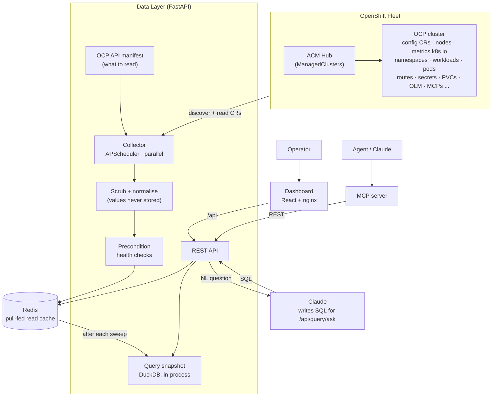
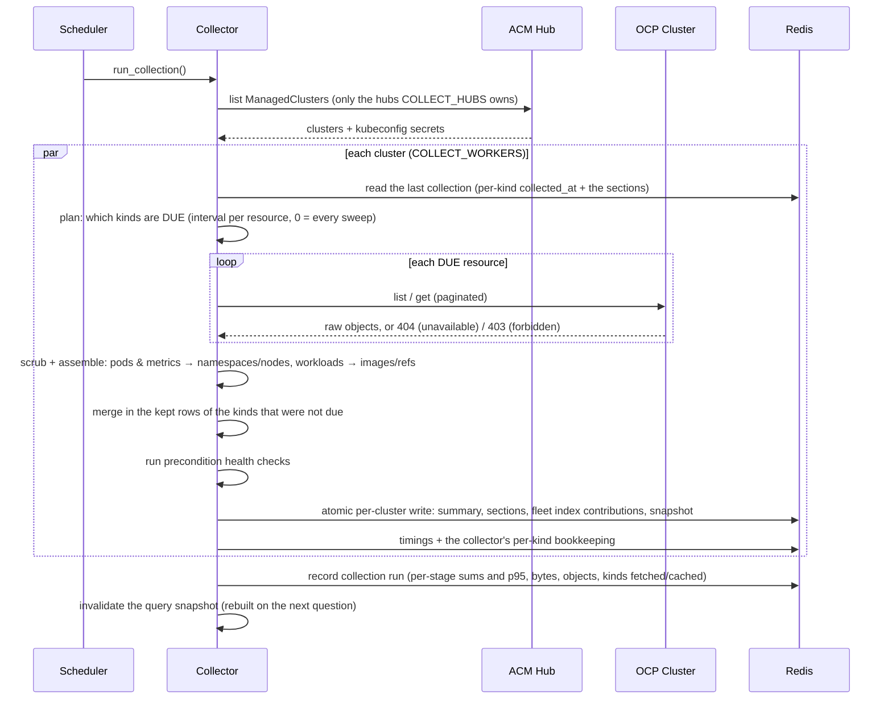
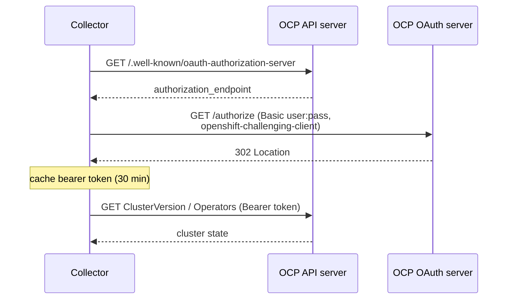
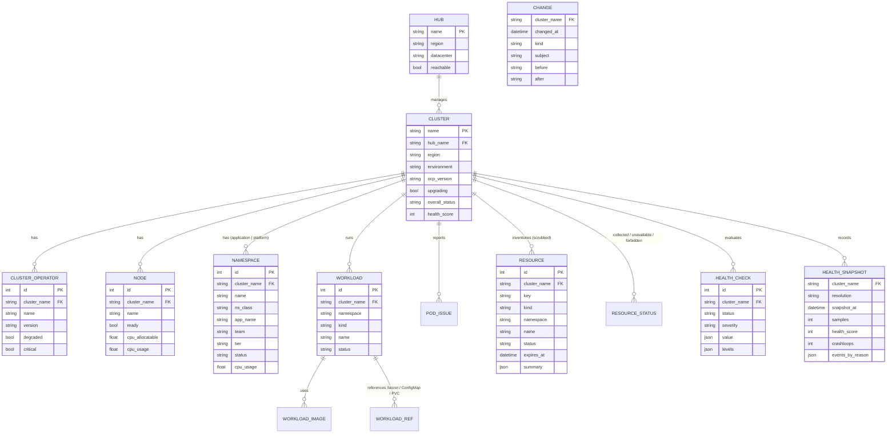
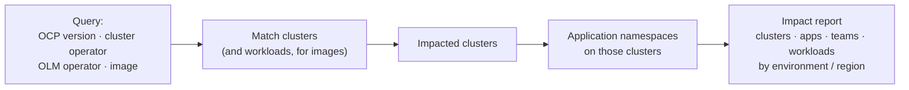
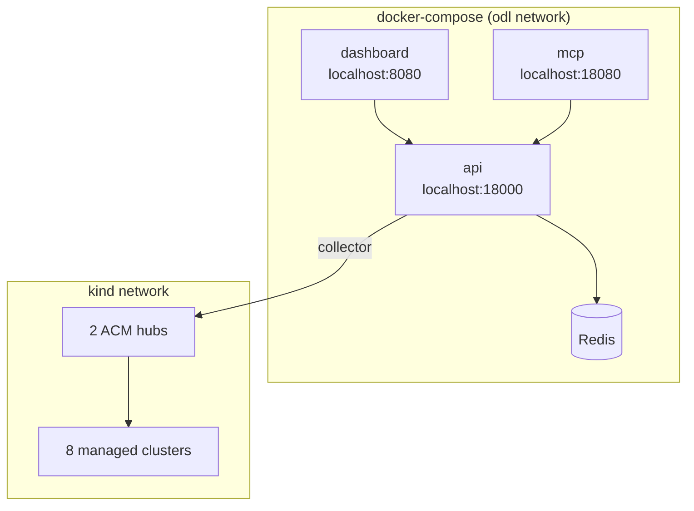
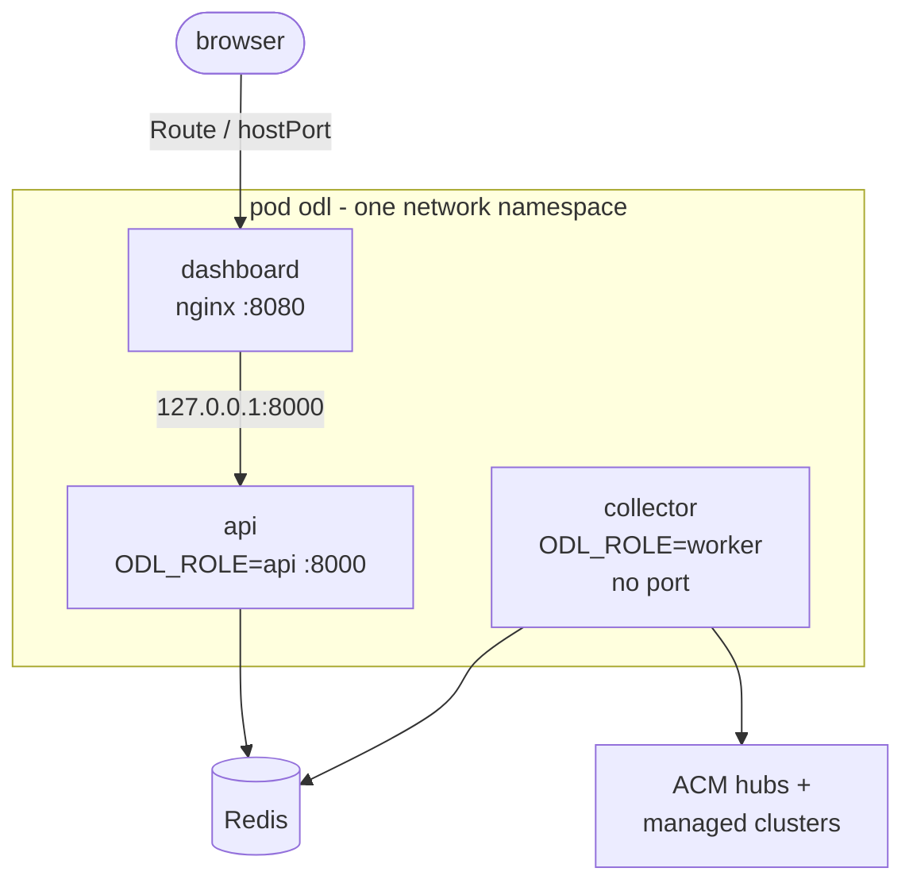

# Architecture

The Operations Data Layer is a read-only data plane over an OpenShift estate.
It collects cluster state on a schedule, computes health, and keeps the collected fleet state in Redis - a pull-fed read cache, not a system of record.
After every sweep an in-process DuckDB snapshot of that state is rebuilt so natural-language questions can be answered in SQL.
It serves all of this through a REST API, a web dashboard, and an MCP server.
This document describes the moving parts and the main flows.

All diagrams are Mermaid and render on GitHub.

## Component architecture

The collector is the only component that talks to clusters.
Everything else reads from Redis, so the cluster API load is bounded by the collection interval and reads are always fast.
Natural-language questions are the one exception: the API also calls Claude to turn a question into SQL, which runs against an in-process DuckDB snapshot of the same Redis state (see [Natural-language queries](#natural-language-queries)).

## Discovery modes

The collector can find clusters two ways, configured in one file (see [onboarding.md](onboarding.md)):

- **ACM hubs** (`hubs:`) - list the hubs; the collector reads each hub's `ManagedCluster` resources and the per-cluster kubeconfig secrets to reach them. This is what the local kind fleet uses, and it scales to large estates because you onboard a hub once.
- **Direct list** (`clusters:`) - enumerate live OCP API endpoints behind shared credentials. The simplest way to onboard clusters that are not under ACM.

Both modes feed the same collect → health-check → persist pipeline.

## Collection flow (ACM mode)

A single cluster can also be pulled on demand, outside this sweep, via `POST /api/clusters/{name}/refresh`; it runs the same gather-and-write step for one cluster behind a single-flight lock, without touching any other cluster.

In direct mode the first two steps are replaced by "for each configured endpoint, authenticate and connect"; the per-cluster loop is identical.

## Authentication (username / password)

OpenShift's API server does not accept HTTP basic auth.
A single shared service account that uses username/password is exchanged for a short-lived bearer token via the same OAuth "challenging client" flow that `oc login` uses.
Tokens are cached for 30 minutes.

Per-cluster `token` and `kubeconfig` auth are also supported.

## What is collected

The OCP API manifest (`data-layer/config/ocp-api-manifest.yaml`) declares every resource the collector reads, each with an `enabled` flag; the resource registry in code defines how each is fetched and generates the read-only RBAC.
Per cluster and per resource the outcome (collected / unavailable / forbidden / error) is stored, so the API can say what each cluster can answer.
ConfigMap and Secret values, certificate material, container env values and non-allow-listed annotations are scrubbed inside the parsers and never persisted.
See [ocp-api-manifest.md](ocp-api-manifest.md).

Applications are namespaces: every non-platform namespace is an application, with ownership from labels; OpenShift's own namespaces are collected and grouped separately.
Utilization comes from `metrics.k8s.io` on each cluster (no Prometheus).

## Health model

Each cluster runs a panel of precondition checks, each returning pass / warn / fail at a severity (critical / warning / info):
cluster reachable, ACM availability, ClusterVersion availability, critical operators available, no degraded operators, nodes ready, node pressure, supported version, upgrade in progress, operators settled, machine config pools, platform pods, application pods, capacity headroom, certificates valid, quota headroom, OLM operators, update available.

Every check is configurable in the manifest's `health_checks:` section: whether it runs at all, what a failure means for the cluster (`severity`), and the `warn:` / `fail:` levels in that check's own unit - a count of degraded operators, a percent of allocatable, a certificate window (see [ocp-api-manifest.md](ocp-api-manifest.md)).
The check panel owns the catalogue of checks, their units and their defaults; the manifest only overrides them.

The rollup rule:

- any **fail** at `critical` severity → `critical`
- any **fail** at `warning` severity, and any **warn** → `warning`
- otherwise → `healthy` (results at `info` severity, such as "update available", an upgrade in progress or a cluster without `metrics.k8s.io`, are surfaced but never degrade the rollup)

A health score (0-100) and a per-cluster history snapshot are recorded on every sweep, which powers the timeline and the trend queries (see [History](#history)).
Every result also carries what it measured and the levels that applied (`value`, `levels`), so "87% used (warn 85, fail 95)" is readable without opening the manifest.
Health is always **computed** from collected state - never read from a field on the cluster - so it behaves identically against the kind fixtures and real OCP.

## Storage model

Collected fleet state lives in Redis, not a relational database.
The collector writes one cluster at a time, atomically (MULTI/EXEC): a summary hash, ten compressed section blobs (operators, nodes, namespaces, workloads, images, refs, pod issues, resources, resource status, health checks), a snapshot appended to that cluster's history, and its contribution to a set of fleet-wide indexes (by region, version, operator, namespace, image, certificate expiry, and more).
A per-cluster ledger records exactly what a cluster contributed to those fleet indexes, so the next write can remove exactly that before adding the new contributions - a reader never sees a stale or half-written cluster.
Fleet-wide questions are answered from those indexes, never by scanning every cluster's detail.
Per-cluster keys carry a TTL (`REDIS_TTL_SECONDS`, default 24h) and the Redis instance runs `maxmemory-policy noeviction`, so a cluster that stops being collected ages out cleanly instead of being silently evicted.

The full keyspace - every key, its type, who writes it and who reads it - is documented in [docs/redis-keyspace.md](redis-keyspace.md); the store implementation lives in `data-layer/app/store/`.

### History

Everything above is the state as of the last sweep, which cannot answer "is this getting worse?".
So each write also appends to two per-cluster histories.

The first is a **time series**, kept at three resolutions so a span of hours and a span of years cost the same to read: every sweep for 48 hours, one row per hour for 90 days, one row per day for two years, each tier trimmed by its own window rather than by a row count.
A row is what a trend is drawn from, so it carries more than the health score: crash loops, image pull errors, OOM kills, pending pods, container restarts, warning events with their commonest reasons, which checks were failing by name, degraded operators, node and application counts.
Rolling a bucket up is per-field and deliberate: counters keep the **worst** value inside the bucket (a ten-minute spike must survive into the daily row), gauges keep the value at its **end**, utilization keeps the **mean** with the peak beside it, and name lists are **unioned**.
The rollup happens inside the write that notices the hour or day has turned, so nothing has to be scheduled and a collector that stops leaves the tiers consistent.

The second is a **change log**, a per-cluster Redis stream of what actually happened: a version moved, a status rolled over, a check started failing or recovered, an operator degraded, nodes or namespaces came and went, an upgrade started or finished, a cluster went unreachable.
Each record carries the value before and after and a sentence describing it.
A time series tells you a number was different an hour ago; the change log tells you what changed, and when.

Both are queryable three ways: `GET /api/clusters/{name}/timeline?resolution=` and `GET /api/clusters/{name}/changes` per cluster, `GET /api/insights/changes` fleet-wide, and the `health_snapshots` and `changes` tables in the SQL snapshot below.
The model, the memory arithmetic at fleet scale, and the exact rollup rules are in [docs/redis-keyspace.md](redis-keyspace.md); the code is `data-layer/app/store/history.py`, which is pure functions over rows.

### Relational view used by natural-language queries

The tables below are not a database - they are the schema of the in-process DuckDB snapshot that natural-language queries run against (see [Natural-language queries](#natural-language-queries)).
They are the same shape the data layer's Postgres schema used to be, kept verbatim so this document, the API's field names, and the SQL an agent writes all describe the same thing.
The only difference is that the surrogate `id` columns are gone; a row is identified by `cluster_name` plus `name` or `namespace`.

## Natural-language queries

Some questions are not one the API was built to answer directly - an arbitrary join or aggregation across clusters, applications, operators, images or certificates.
For those, a question in English becomes SQL against the DuckDB snapshot above: Claude writes the SQL, a guard checks that it is a single read-only `SELECT` over the allowlisted tables before anything runs, and the query executes in-process against the snapshot rebuilt from Redis after every sweep.
Every answer comes back with the SQL that produced it, an explanation, and the assumptions made, so a number is never handed back without a way to check it.
See [docs/nl-query.md](nl-query.md) for the full mechanics (the guard's rules, the semantic layer, the settings) and [ADR-0002](adr/0002-natural-language-queries.md) for why this shape was chosen over the alternatives.

## Blast radius

Because operators, versions, OLM operators, images and applications are all persisted and indexed, a single query turns "X is bad" into a concrete impact list.

The same graph answers dependency questions directly: `/api/insights/references` (who uses this Secret / ConfigMap / PVC), `/api/insights/storage` (which claims ride on a storage class), `/api/insights/images` (who runs this image).

## Refresh & caching strategy

Redis is a pull-fed cache, not a system of record: the collector decides when a cluster's picture changes, and the API only ever reads what the last write left behind.

- The collector sweeps on `REFRESH_INTERVAL_SECONDS` (default 120s) and on demand via `POST /api/refresh`; one cluster can be pulled on demand via `POST /api/clusters/{name}/refresh`, without waiting for the next sweep or touching any other cluster.
- A sweep collects what is **due**, not everything. Each manifest resource carries an `interval` (0 = every sweep, or a tier such as `15m`); the collector records per cluster and per kind when it last fetched it, fetches only the kinds whose tier is up, and keeps the rest of the document from the last collection. The stored document has the same shape either way, so health checks, the store and the API are unaffected. `POST /api/refresh?full=true` (and `?full=true` on a single cluster) ignores every tier, which is what to run after changing the manifest. See [the manifest doc](ocp-api-manifest.md#tiers-collect-each-kind-on-its-own-interval) and `config/ocp-api-manifest.fleet.yaml`.
- Freshness is per kind, not only per cluster: `GET /api/manifest/availability` reports `collected_at`, `cached` and `interval_seconds` for every kind of every cluster, next to what its last fetch cost (requests, bytes, objects, parse time).
- Collection is partitioned by whole hubs before it is partitioned by cluster: `COLLECT_HUBS=man01paa` makes an instance discover, collect and prune only that hub's clusters (it still records that the other hubs exist, and never touches their state), and `COLLECT_SHARD=i/n` then splits the owned hubs' clusters across processes. One collector per ACM hub is the unit an estate of seven hubs with ~114 clusters each is run as.
- A single-flight lock in Redis (`SET NX PX`) prevents two refreshes of the same cluster from racing; a separate in-process lock prevents overlapping full sweeps. Tokens are cached for 30 minutes to keep credential exchanges rare.
- Reads never touch a cluster - the API serves the last write from Redis, so the dashboard and API stay fast and cluster API load is bounded by the poll interval.
- Freshness is visible, not implied: every cluster summary carries `last_synced`, `age_seconds`, and `stale` (age beyond three times `REFRESH_INTERVAL_SECONDS`).
- Per-cluster keys carry a TTL (`REDIS_TTL_SECONDS`, default 24h) and the Redis instance runs `maxmemory-policy noeviction`, so a cluster that is never collected again ages out explicitly instead of being evicted to make room for another.
- Redis persists to disk (RDB snapshots) so an API restart serves the last picture immediately instead of forcing a full re-collection; the cache is still fully rebuildable from the fleet either way.
- Every sweep is recorded as a run for observability of the data layer itself (`GET /api/runs`).

## Deployment topology

Local stack (docker-compose), with the API joined to the kind network so the collector can reach cluster API servers:

The patching service keeps its own Postgres database (the `db` service in `docker-compose.yml`) for its job / approval / audit system of record.
That is a separate service with its own persistence guarantees; moving it off Postgres is out of scope here (see ADR-0001, Consequences).

Everywhere that is not a laptop, the same two images run as one pod of three containers:

The backend image takes its role from `ODL_ROLE`, so the collector and the read-only API are separate processes that fail and scale independently, while remaining one application and one image.
Only the dashboard's port leaves the pod; the API is reachable on localhost by nginx and by nobody else, which is why there is no second Service and no CORS.
A refresh requested from a process that does not collect is queued through Redis and picked up by a collector, and answers 409 only when none is alive.

[`deploy/pod/`](../deploy/pod/) is that pod for `podman kube play` and plain Kubernetes; [`deploy/openshift/`](../deploy/openshift/) is the kustomize base, with an overlay that moves collection into a `StatefulSet` of sharded collectors.
The only real-world change versus local is supplying fleet credentials instead of kind kubeconfigs.
[docs/containers.md](containers.md) covers the images, the build arguments, every environment variable, the security posture and sizing.

## Architecture decisions

- [ADR-0001](adr/0001-redis-as-fleet-state-store.md) - Redis as the fleet state store: a pull-fed read cache with per-cluster section blobs and fleet indexes, not a system of record.
- [ADR-0002](adr/0002-natural-language-queries.md) - natural-language queries: text-to-SQL over an in-process DuckDB snapshot of Redis, validated by a guard, written by Claude.
- [ADR-0003](adr/0003-enterprise-scale.md) - operating at 900 clusters: what changes in the collector, the coordination model, and the read path to get there.

## Scale

At 900 clusters, Redis itself is not what limits the system - it is modeled at roughly 5 GB including fragmentation (ADR-0001).
The collector is the bottleneck: pulling everything on today's 2-minute interval means about 109 GB of raw Kubernetes JSON per sweep across the fleet, which is not viable at that scale.
[ADR-0003](adr/0003-enterprise-scale.md) covers the fix - tiered refresh intervals per resource, watches instead of polling for churny kinds, metadata-only lists where values are not needed, and collector shards coordinated through Redis.
