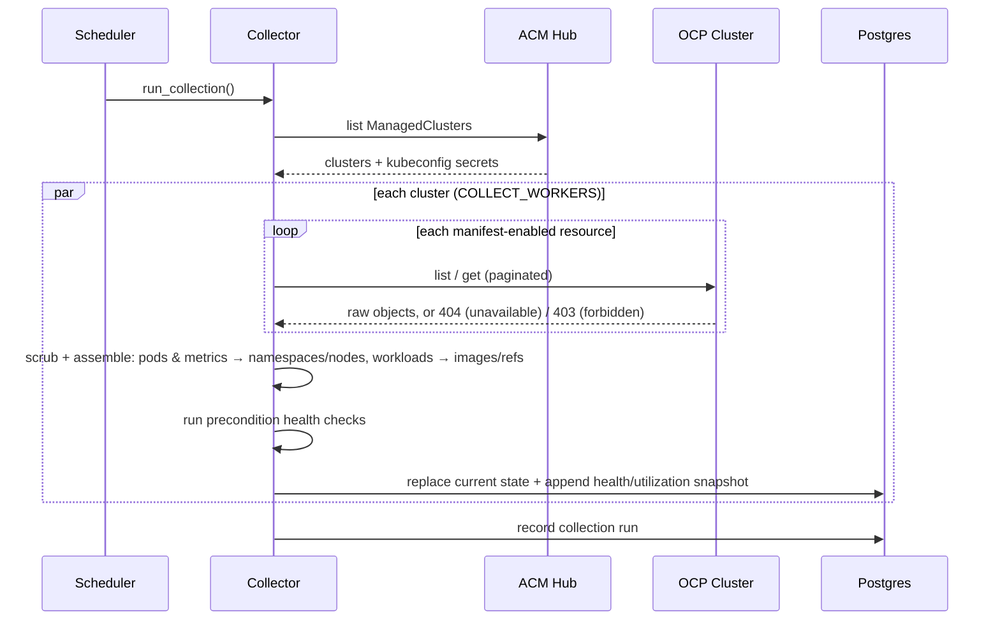
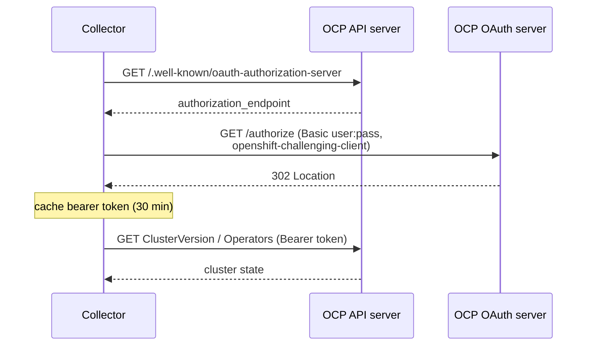
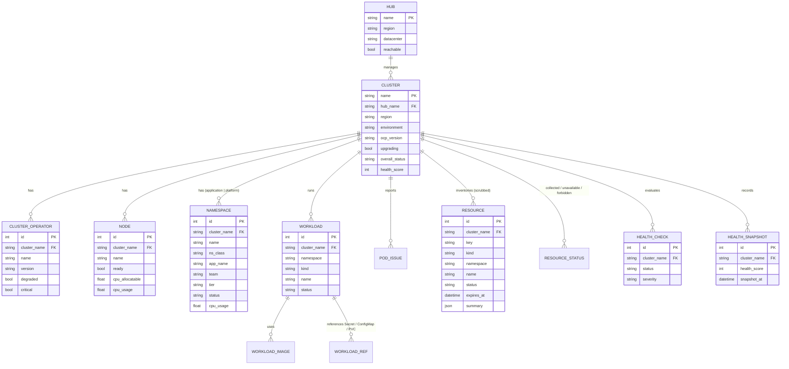
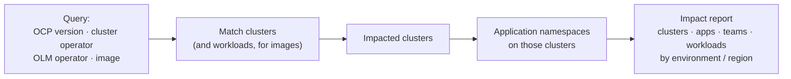
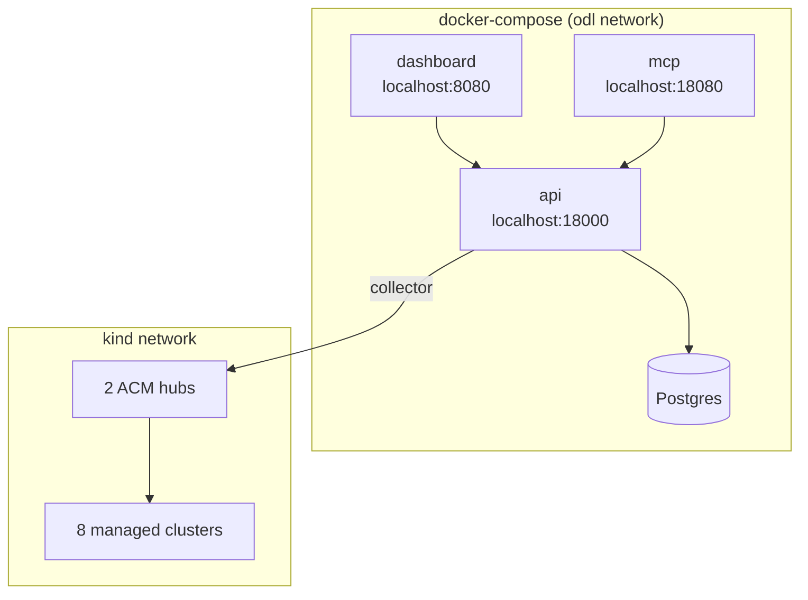

# Architecture

The Operations Data Layer is a read-only data plane over an OpenShift estate.
It collects cluster state on a schedule, computes health, persists everything to Postgres, and serves it through a REST API, a web dashboard, and an MCP server.
This document describes the moving parts and the main flows.

All diagrams are Mermaid and render on GitHub.

## Component architecture

The collector is the only component that talks to clusters.
Everything else reads from Postgres, so the cluster API load is bounded by the collection interval and reads are always fast.

```mermaid
flowchart TB
  user["Operator"]
  agent["Agent / Claude"]

  subgraph fleet["OpenShift Fleet"]
    direction LR
    hub["ACM Hub<br/>(ManagedClusters)"]
    ocp["OCP cluster<br/>config CRs · nodes · metrics.k8s.io<br/>namespaces · workloads · pods<br/>routes · secrets · PVCs · OLM · MCPs ..."]
    hub --> ocp
  end

  subgraph dl["Data Layer (FastAPI)"]
    manifest["OCP API manifest<br/>(what to read)"]
    collector["Collector<br/>APScheduler · parallel"]
    scrub["Scrub + normalise<br/>(values never stored)"]
    checks["Precondition<br/>health checks"]
    api["REST API"]
    manifest --> collector
    collector --> scrub --> checks
  end

  db[("Postgres")]
  dash["Dashboard<br/>React + nginx"]
  mcp["MCP server"]

  fleet -->|"discover + read CRs"| collector
  checks --> db
  api --> db
  dash -->|"/api"| api
  mcp -->|"REST"| api
  agent --> mcp
  user --> dash
```

## Discovery modes

The collector can find clusters two ways, configured in one file (see [onboarding.md](onboarding.md)):

- **ACM hubs** (`hubs:`) - list the hubs; the collector reads each hub's `ManagedCluster` resources and the per-cluster kubeconfig secrets to reach them. This is what the local kind fleet uses, and it scales to large estates because you onboard a hub once.
- **Direct list** (`clusters:`) - enumerate live OCP API endpoints behind shared credentials. The simplest way to onboard clusters that are not under ACM.

Both modes feed the same collect → health-check → persist pipeline.

## Collection flow (ACM mode)

In direct mode the first two steps are replaced by "for each configured endpoint, authenticate and connect"; the per-cluster loop is identical.

## Authentication (username / password)

OpenShift's API server does not accept HTTP basic auth.
A single shared service account that uses username/password is exchanged for a short-lived bearer token via the same OAuth "challenging client" flow that `oc login` uses.
Tokens are cached for 30 minutes.

Per-cluster `token` and `kubeconfig` auth are also supported.

## What is collected

The OCP API manifest (`data-layer/config/ocp-api-manifest.yaml`) declares every resource the collector reads, each with an `enabled` flag; the resource registry in code defines how each is fetched and generates the read-only RBAC.
Per cluster and per resource the outcome (collected / unavailable / forbidden / error) is stored, so the API can say what each cluster can answer.
ConfigMap and Secret values, certificate material, container env values and non-allow-listed annotations are scrubbed inside the parsers and never persisted.
See [ocp-api-manifest.md](ocp-api-manifest.md).

Applications are namespaces: every non-platform namespace is an application, with ownership from labels; OpenShift's own namespaces are collected and grouped separately.
Utilization comes from `metrics.k8s.io` on each cluster (no Prometheus).

## Health model

Each cluster runs a panel of precondition checks, each returning pass / warn / fail at a severity (critical / warning / info):
ACM availability, ClusterVersion availability, critical operators available, no degraded operators, nodes ready, node pressure, supported version, upgrade in progress, operator drift, machine config pools, platform pods, application pods, capacity headroom, certificates valid, quota headroom, OLM operators, update available.

The rollup rule:

- any **critical fail** → `critical`
- any **warning-level** fail or warn → `warning`
- otherwise → `healthy` (informational results such as "update available" are surfaced but do not degrade the rollup)

A health score (0-100) and a per-cluster history snapshot are recorded on every sweep, which powers the timeline.
Health is always **computed** from collected state - never read from a field on the cluster - so it behaves identically against the kind fixtures and real OCP.

## Data model

Current-state tables are replaced on every sweep; `health_snapshot` is append-only for history (health and utilization).
Typed tables hold what has rollups (nodes, namespaces, workloads, pod issues); everything else is a scrubbed row in `resource` with a kind-specific `status` and, for certificate-bearing kinds, `expires_at`.

## Blast radius

Because operators, versions, OLM operators, images and applications are all persisted and indexed, a single query turns "X is bad" into a concrete impact list.

The same graph answers dependency questions directly: `/api/insights/references` (who uses this Secret / ConfigMap / PVC), `/api/insights/storage` (which claims ride on a storage class), `/api/insights/images` (who runs this image).

## Refresh & caching strategy

- The collector polls on `REFRESH_INTERVAL_SECONDS` (default 120s) and on demand via `POST /api/refresh`.
- Reads never touch a cluster - the API serves the last persisted snapshot, so the dashboard and API stay fast and cluster API load is bounded.
- A single in-process lock prevents overlapping sweeps; tokens are cached for 30 minutes to keep credential exchanges rare.
- Every sweep is recorded as a `collection_run` for observability of the data layer itself (`GET /api/runs`).

## Deployment topology

Local stack (docker-compose), with the API joined to the kind network so the collector can reach cluster API servers:

On OpenShift, the same images run as `Deployment`s with the API and dashboard exposed through `Route`s; see [`deploy/openshift/`](../deploy/openshift/).
The only real-world change versus local is supplying per-hub or per-cluster credentials instead of kind kubeconfigs.
