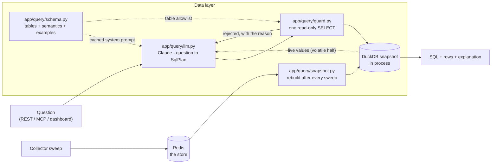

# Natural-language queries

The REST API answers the questions we anticipated.
This feature answers the rest: "which teams run an image on clusters still on 4.15 in eu-west?", "how many application namespaces per team per environment?", "which clusters have both a degraded operator and a certificate expiring this month?".

A question becomes SQL, the SQL is checked by a guard, and the SQL runs against an in-process DuckDB snapshot of the Redis store.
The answer always comes back with the query that produced it: a number nobody can check is worth very little.

## How it works



The retry edge is the loop that makes this usable: if the guard refuses the query or DuckDB cannot run it, the error goes back to the model once, with the SQL that failed.
Two attempts, then the caller gets a 422 showing exactly what was tried.

### Why DuckDB and not Postgres

Redis is the store, and Redis answers the questions it was indexed for.
An ad-hoc question is a join, and joins want a relational engine.
DuckDB is an in-process library, like SQLite, not a database service, so the deployment stays Redis-only: the snapshot is a few MB of memory inside the API process.

The tables it exposes are the tables the data layer always had, the former Postgres schema, so `docs/architecture.md` "Data model", the API field names and the SQL an agent writes all describe the same thing.
The only differences are that the surrogate `id` columns are gone (rows are identified by `cluster_name` plus `name` or `namespace`) and timestamps are UTC `TIMESTAMP` rather than `TIMESTAMPTZ`.

### When the snapshot is rebuilt

The snapshot is built lazily on the first query and then reused.
It is dropped when the collector calls `app.query.snapshot.invalidate()` at the end of a sweep, and, as a safety net, whenever the store reports a collection run newer than the one the snapshot was built from.
`POST /api/query/refresh-snapshot` forces a rebuild.

Building it is one pass over the store: `clusters()`, `hubs()`, `section_across()` for the ten per-cluster sections, `snapshots_across()` once per history tier, `changes_across()`, `runs()`.
Rows are coerced to the declared column types, packed into Arrow columns, and loaded with `INSERT INTO <table> SELECT ... FROM <arrow>`; JSON columns travel as text and DuckDB casts them, so `json_extract(...)` works without a second encode step.

## Trends: history in SQL

Two of the tables are history rather than current state, and they are what makes "is this getting worse?" a question SQL can answer.

**`health_snapshots`** is the fleet measured over time: health score and status, CPU and memory, and what was going wrong (crash loops, image pull errors, OOM kills, pending pods, container restarts, warning events with their reasons, which checks were failing by name, degraded operators).
It holds three time series in one table, told apart by `resolution`:

| `resolution` | One row per | Span the snapshot loads | Ask it about |
|---|---|---|---|
| `sweep` | collection sweep | the last 6 hours | right now, the last few hours |
| `hour` | hour | the last 30 days | a day, a week |
| `day` | day | the last 2 years | a month, a quarter, a year |

The store keeps more than the snapshot loads (48 hours of sweeps, 90 days of hours, 2 years of days); the windows above are what one question is allowed to scan, and they are what keeps a rebuild bounded.
`GET /api/clusters/{name}/timeline?resolution=&since=&until=` reads the store directly when a question needs to reach further back.

**Every query on `health_snapshots` must filter `resolution`.**
Without it the same moment is counted once per series, and an aggregate over the table is meaningless.
The schema says so in the table description, in the column description and in the notes, because it is the one mistake that produces a plausible wrong number rather than an error.

In a rolled-up row the counters are the **worst** value inside the bucket, the gauges are the value at its **end**, and `cpu_usage` / `memory_usage` are the **mean** with the peak beside them in `cpu_usage_max` / `memory_usage_max`.
So "how bad did it get" is `max()`, "how many at once across the fleet" is `sum()` over one bucket, and neither is a sum over sweeps: the same crash-looping pod is counted again by every sweep.
`samples` says how many sweeps are behind a row, which is also how you spot the newest bucket still filling up.

**`changes`** is what happened, one row per event: `cluster_name`, `changed_at`, `kind`, `subject`, `before`, `after`, `message`.
`kind` is a fixed vocabulary of `version`, `status`, `check`, `operator`, `nodes`, `namespace`, `application`, `upgrade`, `reachability`, and `subject` names the thing that changed (the check id, the operator name, the namespace, the target version, or the column name for a scalar).
`before` and `after` are text, whatever they were recorded as, so `'4.15.30' -> '4.16.7'` and `'4' -> '3'` read the same way.
The column is `changed_at` rather than `at` because `at` is a reserved word in DuckDB, and a column nobody can write in SQL is not a column.

Two shapes cover most trend questions:

```sql
-- crash events over time, per hub
SELECT date_trunc('hour', hs.snapshot_at) AS hour, c.hub_name, sum(hs.crashloops) AS crashloops
FROM health_snapshots AS hs
JOIN clusters AS c ON c.name = hs.cluster_name
WHERE hs.resolution = 'hour' AND hs.snapshot_at >= now() - INTERVAL 24 HOUR
GROUP BY hour, c.hub_name
ORDER BY hour;

-- what changed last week
SELECT cluster_name, changed_at, kind, subject, before, after, message
FROM changes
WHERE changed_at >= now() - INTERVAL 7 DAY AND kind = 'version'
ORDER BY changed_at DESC;
```

`events_by_reason` is a JSON object (reason to count), so one reason is `CAST(json_extract(events_by_reason, '$.BackOff') AS BIGINT)` and all of them are `json_each(events_by_reason)`.
`checks_failed_names` is a JSON array: `list_contains(CAST(checks_failed_names AS VARCHAR[]), 'nodes-ready')` tests one, and counting them by name needs `unnest` in a subquery because DuckDB refuses `UNNEST` beside a `GROUP BY`.

## The guard

`app/query/guard.py` is the security boundary and the only path to execution: `service.run_sql` validates before it executes, and nothing else executes SQL.
It works on the parse tree (`sqlglot`, DuckDB dialect), not on the text, and it is a whitelist rather than a list of bad words.

| Rule | What is refused |
|---|---|
| One statement | `SELECT 1; DROP TABLE clusters` |
| SELECT only | Every DDL and DML node, plus `ATTACH`, `DETACH`, `COPY`, `INSTALL`, `LOAD`, `PRAGMA`, `SET`, `CALL`, `USE`, `DESCRIBE`, `SHOW`, wherever they appear. `WITH ... SELECT` and set operations of SELECTs are allowed |
| Known tables | Anything outside the table list, including a CTE-less alias, a file name used as a table (`FROM 'x.csv'`), a catalog (`other.main.clusters`) or a schema (`information_schema.tables`). CTE names defined in the same query are allowed |
| No table functions | `read_csv(...)`, `read_parquet(...)`, `glob(...)`, `duckdb_settings()`, `query(...)`, `postgres_scan(...)` |
| No reaching out | Functions named `getenv`, `current_setting`, `query`, `checkpoint`, and the `read_`, `write_`, `duckdb_`, `pg_`, `sqlite_`, `postgres_`, `iceberg_`, `delta_`, `st_`, `http_` families |
| No paths or remote URLs | String literals starting with `/`, `./`, `../`, `~/`, or with an `s3://`, `gs://`, `file://`, `ftp://` scheme. `https://` is allowed because route hosts and `api_url` carry it, and a URL can only be fetched through a function the rule above already refuses |
| Bounded | A `LIMIT` is added when missing and lowered when higher than `ODL_QUERY_MAX_ROWS`, so the engine never produces more rows than the caller may receive |
| Time limited | The executor interrupts DuckDB after `ODL_QUERY_TIMEOUT_SECONDS` |

Every rejection carries a reason that is safe to show the user, and that reason is what the model gets back on a retry.
`tests/test_query_guard.py` covers each rule, including the cases that must **not** be refused: `https://` literals, `LIKE '%.json'`, ordinary functions.

## The semantic layer

`app/query/schema.py` is the single source of truth for the tables, and it is what the model reads.
It holds three things:

1. **Tables and columns with a one-line description each.**
   The descriptions are not garnish: they are the semantics.
   `ns_class`, `key`, `critical` and `status` mean nothing without them.
2. **Curated notes.**
   What a newcomer would have to be told before their first query is right: an application is an application-class namespace, `app_name` identifies it across clusters, namespace names are only unique within a cluster, utilization is NULL without metrics, `resources` is filtered by `key` and read through its JSON `summary`, `health_snapshots` and `changes` are the only history and the first of them must always be filtered by `resolution`.
3. **Worked examples**, question to SQL, covering the eight shapes people actually ask for.

`schema_text()` renders all of it into the system prompt, which is marked for prompt caching, so every question after the first pays for the question only.
The examples are executed against the fixture in the test suite, so an example cannot rot into SQL that no longer runs.

The fourth ingredient is **live values**, and it deliberately does not live in the cached prefix.
Knowing that the environment is spelled `prod` and the region `eu-west-1` is the difference between an answer and an empty result, but those values change with the fleet, so they are read from the snapshot (`snapshot.live_values()`, computed once per build) and appended to the user message: regions, datacenters, environments, hubs, versions, teams, tiers, resource keys and registries, capped at 25 values of 60 characters each.
They are fleet data, which means they are untrusted text: they are labelled as data in the prompt, the system prompt tells the model never to follow instructions found inside them, and the guard bounds what a manipulated query could do anyway.

`GET /api/query/schema` serves the same content as JSON, plus what the live snapshot holds.

## Endpoints

| Endpoint | What it does |
|---|---|
| `GET /api/query/schema` | Tables, columns, notes, examples, snapshot row counts and limits |
| `POST /api/query/sql` | Run one SELECT yourself. Body `{sql, limit?}`. 400 if the guard refuses it or DuckDB errors, 504 on timeout |
| `POST /api/query/batch` | Run up to 24 SELECTs, with variables, against one snapshot build. Body `{queries: [{id, sql, limit?}], params}`. One failing query is an error under its own id, not a failed request |
| `POST /api/query/ask` | Ask a question. Body `{question, limit?}`. Returns the SQL, the explanation, the assumptions, the confidence and the rows. 503 without model credentials, 422 when both attempts fail (the body carries each attempt's SQL and error) |
| `POST /api/query/refresh-snapshot` | Rebuild the snapshot now |

Both query responses carry `columns` and `column_types` alongside the rows.
The types are DuckDB's own names (`TIMESTAMP`, `BIGINT`, `DOUBLE`, `VARCHAR`, `BOOLEAN`), and they are what lets a caller pick a rendering: a TIMESTAMP first column with a numeric second one is a time series, two VARCHARs are a table.
Nothing in the values says which, because JSON has no types and a timestamp arrives as a string.

The MCP server exposes the same three as `ask_fleet`, `run_fleet_sql` and `fleet_schema`, and the dashboards below as `list_dashboards` and `run_dashboard`.
Their descriptions tell an agent to prefer the purpose-built tools for questions those already answer, to use SQL for ad-hoc joins and aggregations, and to always show the user the SQL.

## Dashboards

A question is one query; an answer people act on is usually several.
"How is man01paa?" is the clusters it manages, the applications on them, where the pods are unhappy, what changed today and which certificates run out this month - five queries about one moment, which is exactly what a dashboard is here.

A dashboard is a JSON document and nothing else: variables, and panels that are a title, a SQL query, a size on a 12-column grid and an opaque `chart` object the front end interprets.
There is no panel type registry and no chart library on this side of the wire.
Definitions are stored server-side (`odl:{fleet}:dashboards`), so a dashboard is something a team has rather than something one browser remembers.

| Endpoint | What it does |
|---|---|
| `GET /api/dashboards` | Summary rows: id, title, description, builtin, panel count, variable names, updated_at. Built-ins first, then saved, each sorted by title |
| `GET /api/dashboards/{id}` | The full definition |
| `PUT /api/dashboards/{id}` | Create or replace a saved dashboard. 400 with the field path when it does not validate, 409 on a built-in id |
| `DELETE /api/dashboards/{id}` | Remove a saved dashboard. 404 when there is none, 409 on a built-in id |
| `POST /api/dashboards/{id}/run` | Body `{params}`. Runs the option queries and every panel in one batch and returns the definition, the effective params, the options per variable, a result or an error per panel, and the generation that answered |

### The definition

```json
{
  "id": "hub-overview",
  "title": "Hub overview",
  "description": "Everything one ACM hub manages.",
  "builtin": true,
  "variables": [
    {"name": "hub", "label": "Hub", "type": "select", "multi": false, "required": true,
     "default": null,
     "sql": "SELECT DISTINCT hub_name AS value FROM clusters ORDER BY 1"}
  ],
  "panels": [
    {"id": "clusters", "title": "Clusters in {{hub}}", "description": "...",
     "sql": "SELECT name, overall_status FROM clusters WHERE hub_name = {{hub}} ORDER BY name",
     "chart": {"type": "auto"}, "w": 6, "h": 2, "limit": 500}
  ],
  "updated_at": "2026-09-14T09:12:44.120391+00:00",
  "updated_by": null
}
```

| Field | Rule |
|---|---|
| `id` | A slug: lowercase letters, digits, `-` and `_`. The id in the URL wins over the id in the body, so a copy-pasted definition saved under a new id becomes that dashboard |
| `variables[].name` | A placeholder name (`[A-Za-z_][A-Za-z0-9_]*`), unique in the dashboard |
| `variables[].type` | `select` (needs `sql`), `text` or `number` (must not have `sql`) |
| `variables[].sql` | A query returning a `value` column and an optional `label`; it feeds the selector. It may not itself use variables (see below) |
| `variables[].multi` | `true` makes the value a list, which substitutes as `('a', 'b')` for an `IN` |
| `variables[].default` | Used when no value is sent. `required` is a hint to the UI, not a reason to refuse a run |
| `panels[].id` | A slug, unique in the dashboard; it is what keys the results |
| `panels[].sql` | Non-empty, and every `{{name}}` in it must be a declared variable |
| `panels[].title` | Interpolated the same way, so a panel can say which hub it is about |
| `panels[].chart` | Opaque to the API: stored and handed back untouched. Defaults to `{"type": "auto"}`. The front end reads `type` (`auto`, `line`, `bars`, `none`), `x`, `y` (a list of columns), `series` and `stack`; `table`, `bar` and a string `y` are accepted as aliases |
| `panels[].w` / `h` | 1-12 grid columns, 1-6 grid rows |
| `panels[].limit` | 1 to `ODL_QUERY_MAX_ROWS`; the guard writes it into the query |
| panels | At most 40 |

Validation failures are `400`s carrying a list of `{field, error}`, where `field` is the path of the thing that is wrong (`panels.2.sql`).
That is a message an editor can put next to the box the user is typing in, which "invalid dashboard" is not.
Unknown fields are refused rather than silently dropped, so `panel:` instead of `panels:` is a message rather than an empty dashboard.

### Variables

Placeholders are `{{name}}`, and they are replaced by **SQL literals** before the guard sees the statement (`app/query/params.py`):

| Value | Becomes |
|---|---|
| `"man01paa"` | `'man01paa'` (inner quotes doubled) |
| `7`, `7.5` | `7`, `7.5` |
| `true` / `false` | `TRUE` / `FALSE` |
| `null` | `NULL` |
| `["a", "b"]` | `('a', 'b')` |
| `[]` | `(NULL)` - matches nothing, which is what an empty selection means |

There is no `{{name:raw}}` and there never will be one.
A hole that can carry SQL is an injection point, and the guard exists precisely so that no such point is reachable: substitution happens first, so `validate` checks the text that will actually run.
A value with a quote in it stays one string - `hub-east' OR '1'='1` is a hub nobody has, not a predicate - and anything shaped like a placeholder that is not one (`{{ hub }}`, `{{hub:raw}}`) is refused where it is written.

A placeholder with no value is a `400` naming it on `/api/query/batch`.
On a dashboard run it is not an error at all: the UI has to draw the selector before anyone can pick a hub, so the options come back and only the panels that reference the missing variable are returned as `{"error": "variable hub is not set"}`.

A variable's own options query may not use variables.
Options and panels are resolved in one batch against one snapshot, so a selector chained to another selector cannot be filled in the same pass; refusing it when the dashboard is saved is better than resolving nothing when it is run.

Panel titles are interpolated by the client from the `params` the run returns - they are plain text, so nothing needs escaping there, and the backend's job is only to guarantee that every name in a title is a declared variable.

### Running one

```
POST /api/dashboards/hub-overview/run   {"params": {"hub": "man01paa"}}
```

```json
{"dashboard": {...}, "params": {"hub": "man01paa"},
 "variables": {"hub": {"options": [{"value": "man01paa", "label": "man01paa"}]}},
 "results": {"clusters": {"sql": "...", "columns": [...], "column_types": [...], "rows": [...],
                          "row_count": 12, "truncated": false, "elapsed_ms": 3, "generation": 7},
             "applications": {"error": "...", "sql": "..."}},
 "generation": 7, "snapshot": {...}}
```

The option queries share the batch with the panels, so the selector a user sees and the numbers beside it describe the same moment.
Every panel reports the `generation` that answered it, and it is the same one for all of them: a dashboard whose panels straddled a rebuild would quietly disagree with itself.

`POST /api/query/batch` is the same machinery without a stored definition - it is what a front end uses for a page it assembles itself:

```json
{"queries": [{"id": "clusters", "sql": "SELECT ... WHERE hub_name = {{hub}}", "limit": 500},
             {"id": "apps", "sql": "SELECT ..."}],
 "params": {"hub": "man01paa", "days": 7}}
```

Both share the same rules: up to 24 queries per batch request (a dashboard may have 40 panels), each query validated on its own and capped by its own `limit`, each bounded by `ODL_QUERY_TIMEOUT_SECONDS`, and the whole batch bounded by three times that.
A query that fails - the guard refused it, DuckDB could not run it, or the batch ran out of budget before it started - comes back as `{"error": ..., "sql": ...}` under its own id while the rest still answer.
A broken panel is a broken panel, not a broken page.

### The built-ins

Four dashboards ship with the data layer, as YAML in `data-layer/config/dashboards/`.
They are read-only: they are part of the image and an upgrade replaces them, so a change saved over one would be lost - `PUT` and `DELETE` on a built-in id answer `409 clone it under another id`.

| Dashboard | Variables | Panels |
|---|---|---|
| `hub-overview` | `hub` | Clusters, health distribution, applications, namespaces per cluster, crash loops and pod issues over 24h, today's changes, certificates expiring within 30 days |
| `application-overview` | `app` | Placements, workloads, unhealthy pods, images, restarts and pod issues over 24h |
| `cluster-overview` | `cluster` | Summary row, health checks, operators needing attention, nodes, top namespaces by CPU, health and crash loops over 7 days, changes over 7 days |
| `fleet-trends` | `days` (number, default 7) | Crash loops per hub per hour, warning events per day, the checks that fail most, version changes, applications and clusters per hub |

Every panel of every built-in is executed against the two-cluster fixture in `tests/test_dashboards.py`, with the variables filled from the dashboards' own option queries.
A column renamed in `app/query/schema.py` therefore breaks a test rather than a dashboard in production.

### Adding one

Write a YAML file in `data-layer/config/dashboards/` (built-in, shipped) or `PUT` a JSON definition (saved, editable):

```yaml
id: storage-pressure
title: Storage pressure
description: PVCs that are not bound, by cluster.
variables:
  - name: env
    label: Environment
    type: select
    sql: |
      SELECT DISTINCT environment AS value FROM clusters WHERE environment IS NOT NULL ORDER BY 1
panels:
  - id: pending-pvcs
    title: Pending PVCs in {{env}}
    w: 12
    h: 3
    chart: {type: none}
    sql: |
      SELECT r.cluster_name, r.namespace, r.name, r.status
      FROM resources AS r
      JOIN clusters AS c ON c.name = r.cluster_name
      WHERE r.key = 'persistentvolumeclaims' AND r.status <> 'bound' AND c.environment = {{env}}
      ORDER BY r.cluster_name, r.namespace
```

The file is validated at startup with the same models the API uses, so a built-in that cannot run is a startup error naming the file, not a 500 at somebody's first request.
`ODL_DASHBOARDS_DIR` points the loader somewhere else.
The SQL is subject to the guard like every other query here, which is the answer to "what can a dashboard do?": exactly what `/api/query/sql` can do, and nothing more.

## Adding a golden question

`data-layer/tests/golden_questions.yaml` is the regression suite and the eval set.
Add an entry:

```yaml
- id: routes-per-cluster
  question: How many routes does each cluster serve?
  sql: |
    SELECT cluster_name, count(*) AS routes
    FROM resources
    WHERE key = 'routes'
    GROUP BY cluster_name
    ORDER BY routes DESC
  expect:
    min_rows: 1
    contains: {cluster_name: ocp-east-1}
```

`expect` supports `row_count` (exact), `min_rows`, `columns` (a subset that must be present) and `contains` (a mapping, or a list of mappings, each of which must match at least one row).

The reference SQL is asserted twice: `tests/test_query_snapshot.py` runs it against the two-cluster fixture and checks `expect`, and `scripts/eval_ask.py` uses it as the yardstick for what the model produced.
If your question needs data the fixture does not have, add it to the fixture in `tests/test_query_snapshot.py` rather than weakening the expectation.

## Running the eval

The eval answers the only question that matters after a prompt change: does the model still write SQL that answers these questions?

```bash
cd data-layer
.venv/bin/python scripts/eval_ask.py --base-url http://localhost:18000
```

It needs a running data layer with data in it, and credentials for the model (the data layer's, not the script's).
For each golden question it sends the question to `/api/query/ask`, runs the reference SQL through `/api/query/sql`, and reports:

- **status** - pass or fail, from the `expect` block evaluated against the generated answer;
- **try** - how many attempts the self-correcting loop needed (2 means the first query did not run);
- **conf** - the model's own confidence;
- **rows** - coverage: `exact`, `extra rows`, `missing rows` or `differs`, comparing the generated rows with the reference rows. Extra columns are fine; missing facts are not.

Failures print the generated SQL, which is what you tune the prompt against.
Exit status is 1 if anything failed, so it can gate a change.
`--id` runs a single question, `--limit` and `--timeout` bound each call.

Tests never call the model: `app.query.llm.set_generator()` swaps the generator for a stub, and `tests/test_query_api.py` uses it to prove the loop, the retry and the error mapping.

## Settings

| Variable | Default | What it does |
|---|---|---|
| `ODL_QUERY_MODEL` | `claude-opus-5` | The model that writes the SQL |
| `ODL_QUERY_EFFORT` | `medium` | Thinking effort for the generation |
| `ODL_QUERY_MAX_TOKENS` | `4096` | Output cap for one generation |
| `ODL_QUERY_MAX_ROWS` | `500` | Hard row cap; the guard writes it into the query |
| `ODL_QUERY_TIMEOUT_SECONDS` | `10` | Wall-clock budget per query, enforced by interrupting DuckDB |
| `ODL_QUERY_MAX_ATTEMPTS` | `2` | Generation attempts per question, including the retry |
| `ANTHROPIC_API_KEY` | - | Model credentials. An `ant auth login` profile works too; without either, `/ask` is a 503 and `/sql` still works |

## Limitations

**Freshness is the last sweep.**
The snapshot is a copy of what the collector wrote, so an answer is as old as `clusters.last_synced`.
A question about the state of a cluster right now should trigger a refresh first (`POST /api/refresh`), then ask.

**One process, one snapshot.**
Each API replica builds its own snapshot; they can be a sweep apart from each other.
The generation counter in every response says which build answered.

**Rebuild cost grows with the fleet.**
The whole store is read and loaded on every rebuild, once per sweep.
On the two-cluster test fixture that is a few milliseconds; at 900 clusters it is a full read of every section blob, plus the three history tiers and the change log (each one pipelined call for the whole fleet, but still hundreds of thousands of rows within the windows above).
History is the part that grows fastest, so it is the first thing to shorten: the windows live in `HISTORY_WINDOWS` in `app/query/snapshot.py`, and the REST timeline reaches further back without touching the snapshot.
The fix, when we get there, is to build incrementally: one Parquet partition per cluster written by the collector as it persists that cluster, with DuckDB reading the partitions it needs, so a sweep touches only the clusters that changed.
See ADR-0002 for the scale analysis.

**The snapshot is not a system of record.**
It is rebuilt from Redis, which is itself a pull cache.
Nothing writes to it, and nothing should read it for anything that must be durable.

**The model can still be wrong.**
It can pick the wrong column or misread a vague question, which is why the SQL, the assumptions and the confidence come back with every answer, and why the golden questions exist.
The guard bounds what a wrong query can do, not whether it is the query you wanted.
