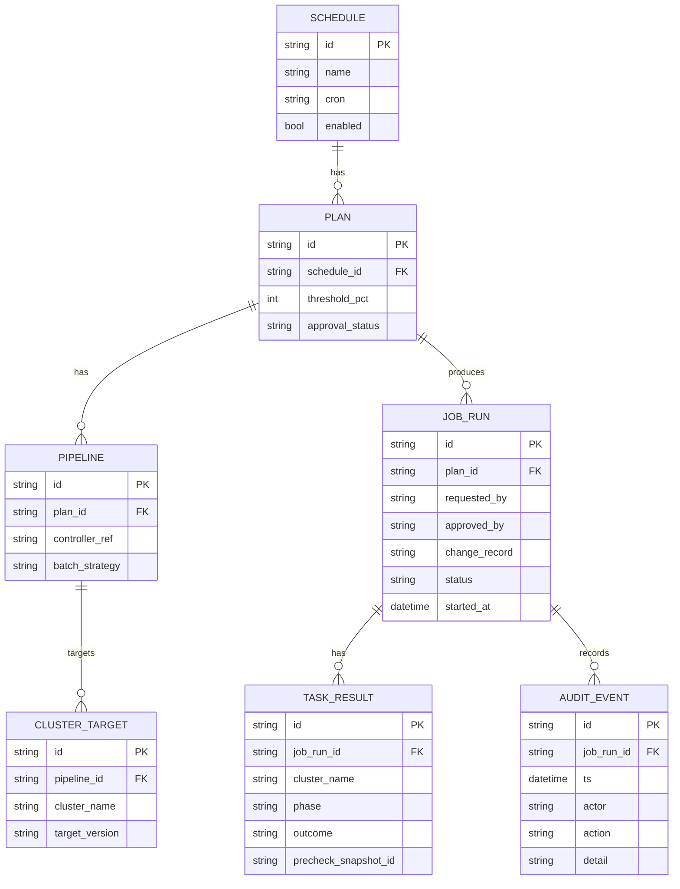
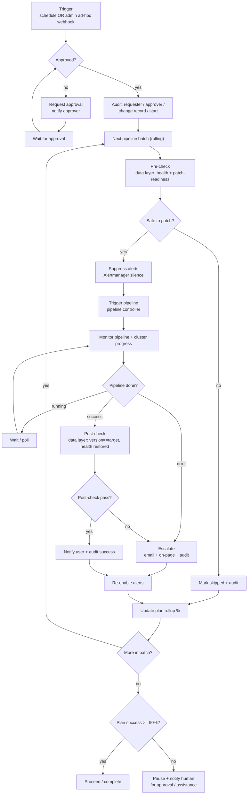

# Patching orchestration - workflow design (N8N)

A design for a platform-agnostic patching app (starting with OpenShift) that schedules, approves, and executes rolling patches across a multi-ACM fleet, orchestrated in **N8N** and using the Operations Data Layer for its pre-checks, monitoring, and post-checks.

## The boundary: orchestrator vs data lake vs executor

Three systems, clean responsibilities:

- **Patching app (N8N + its own database)** - the **system of record**. Owns the schedule/plan/pipeline/cluster model, approvals, job status, and the immutable audit trail. None of this lives in the data lake (which is read-only current-state, overwritten each sweep).
- **Operations Data Layer** - the **"is it safe / is it progressing / did it work" oracle**. Called at pre-check, monitor, and post-check. Never the audit store.
- **Pipeline controller** (Tekton/Ansible/etc.) - the **executor**. Performs the actual patch; owns version control and input validation (per your note).
- **Alertmanager** (suppress/re-enable) and **notification/ITSM** (approvals, escalation, change records) - the side systems the app acts on.

## Domain model (the patching app's own tables)



Hierarchy: a **Schedule** has 1..n **Plans**; a Plan has 1..n **Pipelines**; a Pipeline has 1..n **Cluster targets**.
Monitoring and the success threshold are evaluated at the **plan** level.

## Orchestration flow



## Data-layer integration contract

What the workflow asks the Operations Data Layer at each gate (today's endpoints; `(+)` marks patch-readiness signals worth adding to the data layer):

**Pre-check** - "is this cluster safe to patch now?"
- `GET /api/clusters/{name}/health` → `overall_status`, the precondition checks.
- `GET /api/clusters/{name}` → `ocp_version` (expected source), `upgrading` (must be false - don't double-patch), `available_updates` (target must be reachable).
- `GET /api/metrics/cluster/{name}/utilization` → don't patch a saturated cluster (drains need headroom).
- `(+)` ClusterVersion `Upgradeable=True` condition; `(+)` no critical alerts firing.
- **Decision:** safe if `overall_status` in {healthy, warning}, `upgrading == false`, target in `available_updates`, headroom OK, and (when added) `Upgradeable==true` with no critical alerts.

**Monitor** - "is the patch progressing / has it errored?"
- `GET /api/clusters/{name}` → poll `upgrading`, `upgrade_percent`, `desired_version`; watch for degraded operators.
- Pipeline run status from the pipeline controller's own API.

**Post-check** - "did it land and is it healthy?"
- `POST /api/refresh` (force a fresh sweep), then `GET /api/clusters/{name}` → `ocp_version == target_version`, `overall_status == healthy`, no degraded operators, nodes ready.
- Compare `health_score` against the pre-check snapshot (regression, not just absolute failure).

**Planning / who-to-notify** - `GET /api/blast-radius?ocp_version=...` → impacted apps/teams, to drive batch ordering and notifications.

Record the data-layer reading ids on the `TASK_RESULT` (`precheck_snapshot_id`) so the audit trail references the evidence without copying telemetry into the audit store.

## N8N node mapping

| Lifecycle step | N8N node | Calls |
|---|---|---|
| Scheduled trigger | Schedule Trigger | - |
| Ad-hoc admin trigger | Webhook | - |
| Load plan | HTTP Request / Set | patching app DB |
| Approval gate | IF + Wait (resume on webhook) | approver via notify; resumes on callback |
| Rolling batches | Split In Batches | - |
| Pre-check | HTTP Request | data layer `/api/clusters/{}/health`, `/utilization` |
| Safe-to-patch gate | IF | - |
| Suppress alerts | HTTP Request | Alertmanager `POST /api/v2/silences` |
| Trigger pipeline | HTTP Request | pipeline controller |
| Monitor (loop) | Wait + HTTP Request + IF | pipeline controller + data layer |
| Post-check | HTTP Request | data layer `/api/clusters/{}` |
| Notify success | HTTP Request | email / Slack |
| Escalate failure | HTTP Request | email + PagerDuty/on-page |
| Re-enable alerts | HTTP Request | Alertmanager `DELETE` silence |
| Plan threshold gate | Code + IF | computes success %, compares to `threshold_pct` |
| Audit (every step) | HTTP Request | patching app DB (append-only) |

## Threshold & approval gates

- **Approval:** a Plan does not execute until `approval_status == approved`. The workflow requests approval (notify) and **Waits** on a resume webhook the approver hits; the approver identity and timestamp are audited.
- **90% threshold:** after a Plan's batches finish, a Code node computes `successful / total`. If `>= threshold_pct` (default 90) the automation **proceeds** to the next Plan; otherwise it **pauses and notifies a human** for approval/assistance. The threshold is per-Plan (`PLAN.threshold_pct`).
- **Admin ad-hoc:** the Webhook entry lets a super-user trigger a Plan out of schedule; same approval/audit path applies (or an admin-override flag, audited).

## Platform-agnostic note

OpenShift is the first provider. Keep the workflow provider-agnostic by having pre-check/monitor/post-check call an **abstract data-layer contract** (`/api/clusters/{}` shapes), not OCP-specific fields. For Redis/Azure/GCP, the data layer implements the same `overall_status` / `version` / `upgrading` / readiness contract per provider, and only the **executor** (pipeline controller) and the readiness signals differ. The N8N graph stays the same.

## This is built, not just designed

The system of record described above is implemented as the **patching-service** (`patching-service/`, FastAPI + a dedicated `patching` Postgres database) with `PatchJob` / `PatchTask` / append-only `AuditEvent` tables and a **Patching tab** in the dashboard (submitter status, operator board, director rollup, immutable audit trail). The N8N workflow writes to it.

## Running it

```sh
docker compose up -d n8n patching     # N8N http://localhost:5678 · service http://localhost:18010/docs
```

Import `patching/n8n-patching-workflow.json` (Workflows → Import from File), then **Run manually** (or submit the form at `/form/patch-request-form`).
The workflow:
- **Create Job** + **Record Approval** → write the job and the approver to the patching service (`http://patching:8000`).
- **Pre-check** / **Monitor** → call the data layer (`http://api:8000`); the **Safe to patch?** gate skips unhealthy clusters.
- **Audit** nodes → POST per-cluster pre/post-check events to the patching service (the immutable trail).
- **Read Job Result** + **Threshold met?** → read the rolled-up success % back from the service and pause below the plan threshold.

Alert-suppression, pipeline-trigger, and notification nodes are placeholders pointing at example URLs - wire them to your Alertmanager, pipeline controller, and notifier.
`patching-service/seed_demo.py` drives the same API calls without N8N (useful for testing the service directly).
Verified end-to-end: a run creates an approved, audited job, skips the degraded cluster, and pauses at 67% against the 90% threshold.
